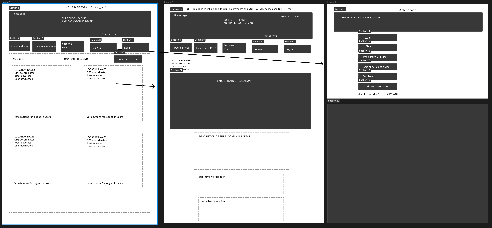

# Surf-spot-SEI-Project-2

Database project storing surf details through a CRUD app. Full-stack development with Ruby on Rails for backend.

---

## :surfer: :surfing_man: :surfing_woman: Page url: https://surf.fly.dev/

---

## :page_facing_up: About

- A CRUD application with different levels of access. Basic access to view content make by users. User access - to provide reviews and rate locations etc. ADMIN access - to edit and delete information from the site.
- List of surf locations. Locations can be added to by users, upvoted etc. Goal is to link to a weather API and have the ability to list locations via distance from the user or another location of choice.

---

## Features in the pipe line (Get it...Pipeline..🏄🏄):

- Rate your board quiver and see the top rated boards.
- Weather API to show SWELL details at the best locations.
- Board suggestions for the day's conditions.

---

## 🗒️ - Planning & Problem Solving

---

## 🧰: Tech

- Programming language: Ruby (ERB)
- Ruby Gems: Sinatra, puma, pg, bcyrpt, httparty.
- API requests.
- SQL databases.

- Location pin adapted from: https://codepen.io/mahdiarjangi/pen/KKKZZjZ

---

## :bug: Bugs to fix

- No weather API linked.

---

## :sob: Lessons learnt

- Started with CSS layout in mind. So far, so good.

---

## :white_check_mark: Cool things I would add if I can keep working on this

- CSS desing. Knowing this was an area I was not skilled in prior to the project, I made an effort to make it a top priority around responsive design. I am happy with the achievements made, however would love to continue my knwoeldge in this area.
